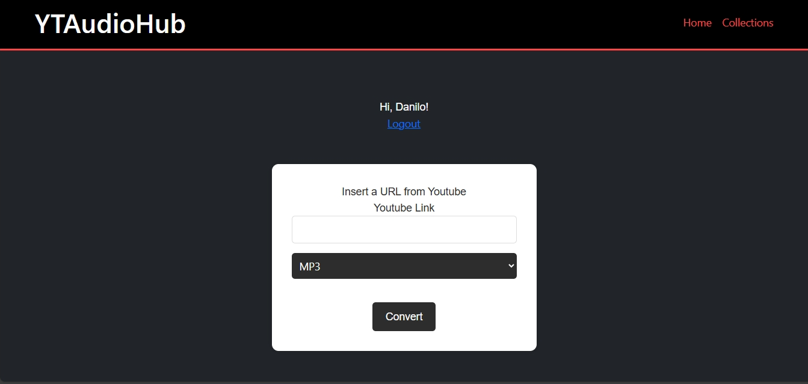

**YTAudioHub** is a personal project that allows you to convert YouTube videos to mp3 or wav, download them and categorize them, plus instructions on how to convert in index.html




## **How to Run the Project**

```bash
pip install -r requirements.txt

python run.py
```
